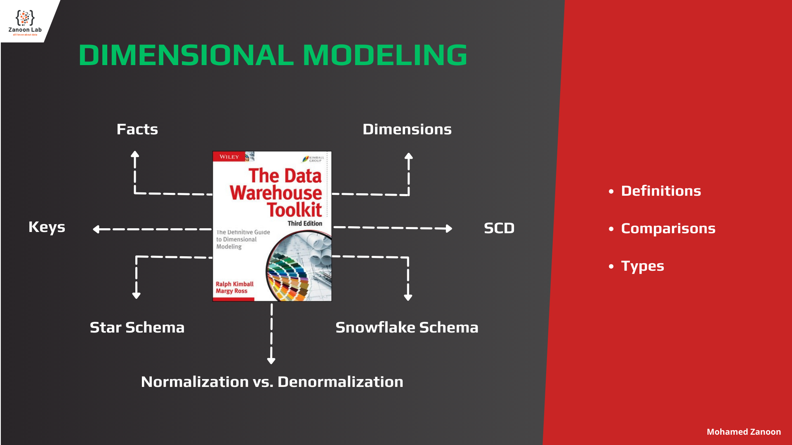
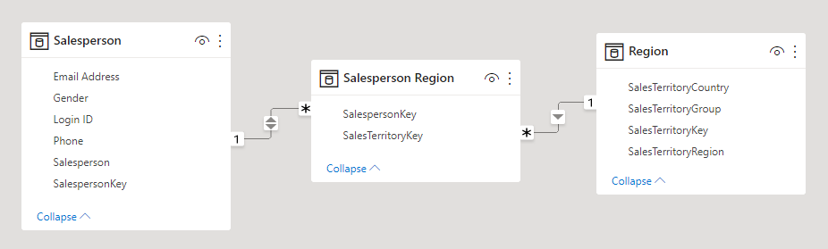
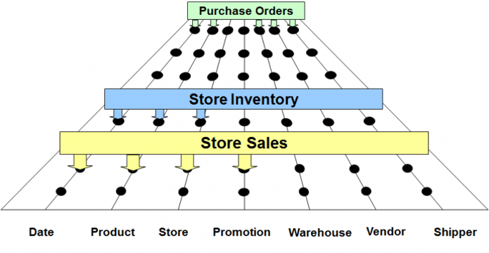
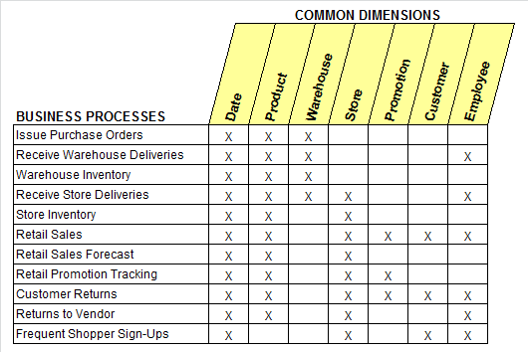
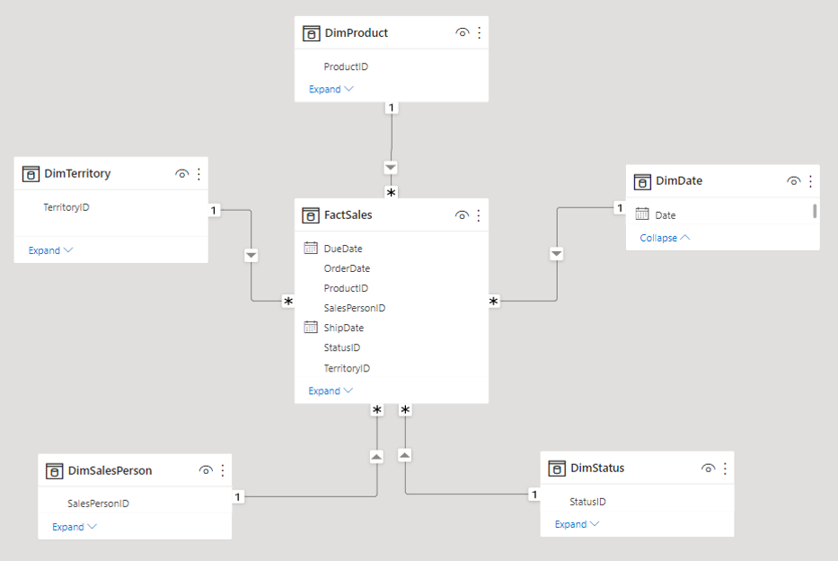
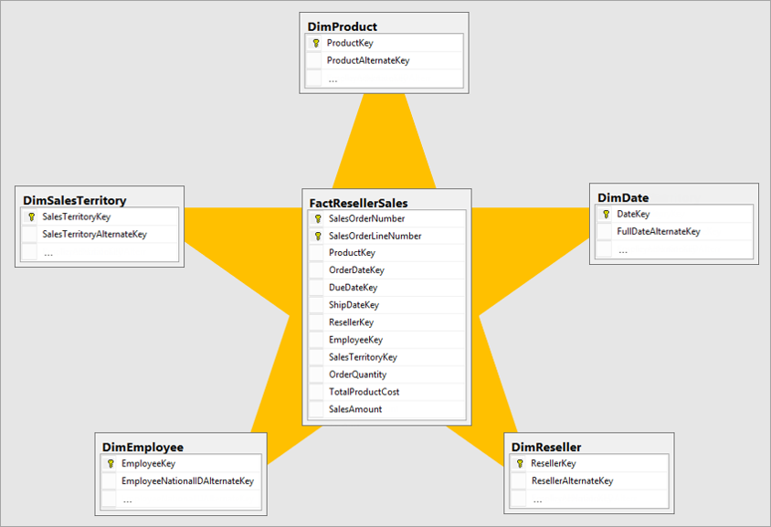
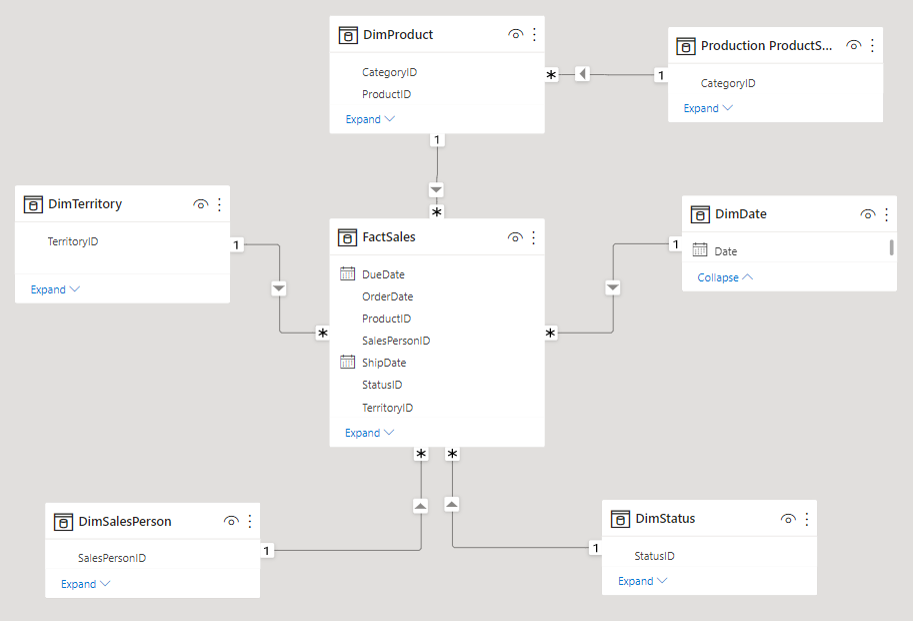
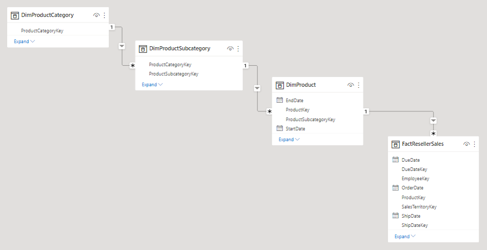
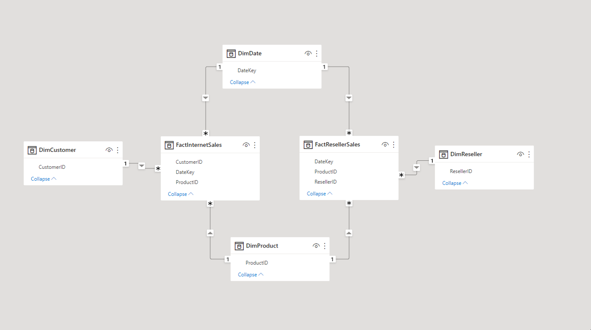
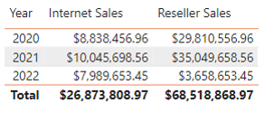

# Brief on Dimensional Modeling - The Data Warehouse Toolkit

Source: The Data Warehouse Toolkit - 3rd Edition - (Author: Ralph Kimball)

## What is Dimensional Modeling?

Dimensional Modeling (DM) is a data structure technique optimized for data storage in a Data warehouse. **The purpose of dimensional modeling is to optimize the database for faster retrieval of data.** The concept of Dimensional Modelling was developed by **Ralph Kimball** and consists of **fact** and **dimension** tables.

A dimensional model in data warehouse is designed to read, summarize, analyze numeric information like values, balances, counts, weights, etc. in a data warehouse. In contrast, relation models are optimized for addition, updating and deletion of data in a real-time Online Transaction System.
in the relational mode, normalization and ER models reduce redundancy in data. **On the contrary**, dimensional model in data warehouse arranges data in such a way that it is **easier to retrieve information and generate reports**.

-----------------------------------------------------------------------------------------

## Normalization vs. Denormalization

- Normalization is the technique of dividing the data into multiple tables to reduce data redundancy and inconsistency and to achieve data integrity. On the other hand, Denormalization is the technique of combining the data into a single table to make data retrieval faster.
- Normalization is used in OLTP system, which emphasizes on making the insert, delete and update anomalies faster. As against, Denormalization is used in OLAP system, which emphasizes on making the search and analysis faster.
- Data integrity is maintained in normalization process while in denormalization data integrity harder to retain.
- Redundant data is eliminated when normalization is performed whereas denormalization increases the redundant data
- Normalization increases the number of tables and joins. In contrast, denormalization reduces the number of tables and join.
- Disk space is wasted in denormalization because same data is stored in different places. On the contrary, disk space is optimized in a normalized table.

Normalization and denormalization are useful according to the situation. Normalization is used when the faster insertion, deletion and update anomalies, and data consistency are necessarily required. On the other hand, Denormalization is used when the faster search is more important and to optimize the read performance. It also lessens the overheads created by over-normalized data or complicated table joins.

-----------------------------------------------------------------------------------------

## Goals of Data Warehousing and Business Intelligence

- The DW/BI system must Make information easily accessible.
- The DW/BI system must present information consistently.
- The DW/BI system must adapt to change.
- The DW/BI system must present information in a timely way.
- The DW/BI system must be a secure bastion that protects the information assets.
- The DW/BI system must serve as the authoritative and trustworthy foundation for improved decision making.
- The business community must accept the DW/BI system to deem it successful.

By walking through the halls of any organization and **listening to business management**:

- We collect tons of data, but we can't access it.
- We need to slice and dice the data every which way.
- Business people need to get at the data easily.
- Just show me what is important.
- We spend entire meetings arguing about who has the right numbers rather than making decisions.
- We want people to use information to support more fact-based decision making.

### Goals

- The DW/BI system must make information easily accessible.
- The DW/BI system must present information consistently.
- The DW/BI system must adapt to change.
- The DW/BI system must present information in a timely way.
- The DW/BI system must be a secure bastion that protects the information assets.
- The DW/BI system must serve as the authoritative and trustworthy foundation for improved decision making.
- The business community must accept the DW/BI system to deem it successful.

-----------------------------------------------------------------------------------------

## Dimensional modeling requirements

- Deliver data that's understandable to the business users.
- Deliver fast query performance.

-----------------------------------------------------------------------------------------

## Dimensional Design Process

1. Select the business process:

Business processes are the **operational activities** performed by your organization, such as taking an order, processing an insurance claim, registering students for a class, or snapshotting every account each month.

2. Declare the grain:

The grain establishes exactly **what a single fact table row represents**.

3. Identify the dimensions:

Dimensions provide the **"who, what, where, when, why, and how"** context surrounding a business process event. Dimension tables contain the **descriptive attributes** used by BI applications for filtering and grouping the facts.

4. Identify the facts:

Facts are the **measurements** that result from a business process event and are **almost always numeric**.

-----------------------------------------------------------------------------------------

## Elements of Dimensional Data Model

- Fact Tables
- Dimension Tables
- Attributes

## ◼ Fact Table

- The fact table in a dimensional model stores the performance **measurements/facts** resulting from an organization's business process events.
- The fact table Is an **event** or a **transaction** that **may or may not include measures** and **Foreign key** to dimension table.

### Fact Types

- **Additive** Facts:

can be summed across any of the dimensions associated with the fact table.
ex: sales amount

- **Semi-additive** Facts:

can be summed across some dimensions, but not all.
ex: Account Balance, cannot be summed across the time dimension.

- **Non-additive** Facts:

can never be added.
ex: Unit Prices, ratios

### Fact Table Types

- **Transaction** Fact Tables:

A row in a transaction fact table corresponds to a measurement event at a point in space and time.

- **Periodic Snapshot** Fact Tables:

A row in a periodic snapshot fact table summarizes many measurement events occurring over a standard period, such as a day, a week, or a month.

- **Accumulating Snapshot** Fact Tables:

A row in an accumulating snapshot fact table summarizes the measurement events occurring at predictable steps between the beginning and the end of a process.

### Factless Fact Tables

A row in an factless fact table not have a numeric fact, the event merely records a set of dimensional entities coming together at a moment in time.

Although most measurement events capture numerical results, it is possible that the event merely records a set of dimensional entities coming together at a moment in time. For example, an event of a student attending a class on a given day may not have a recorded numeric fact, but a fact row with foreign keys for calendar day, student, teacher, location, and class is well-defined. Factless fact tables can also be used to analyze what didn't happen. These queries always have two parts: a factless coverage table that contains all the possibilities of events that might happen and an activity table that contains the events that did happen. When the activity is subtracted from the coverage, the result is the set of events that did not happen.

## ◼ Dimension Table

- The dimension tables contain the textual context associated with a business process measurement event. They describe the **who, what, where, when, how, and why** associated with the event.
- A dimension is a window to view information in the facts.
- Ex:
  - Who: Customer Names
  - What: Product Name
  - Where: Location
  - When: Order Date

### Dimension Table Types

- **Degenerate** Dimensions:

When the dimension attribute is stored as part of the fact table and not in a separate table (ex: Invoice number).

- **Calendar Date** Dimensions:

Calendar date dimensions are attached to virtually every fact table to allow navigation of the fact table through familiar dates, months, fiscal periods, and special days on the calendar.

- **Role-Playing** Dimensions:

A single physical dimension can be referenced multiple times in a fact table.

- **Junk** Dimensions:

Low-cardinality flags and indicators combining them together in a single junk dimension.

- **Snowflaked** Dimensions:

When a hierarchical relationship in a dimension table is normalized, low-cardinality attributes appear as secondary tables connected to the base dimension table by an attribute key.

- **Outrigger** Dimensions:

A dimension can contain a reference to another dimension table.

- **Conformed** Dimensions:

Dimension tables conform when attributes in separate dimension tables have the same column names and domain contents. (Common dimensions, master dimensions, reference dimensions and shared dimensions)

- **Shrunken** Dimension:

Shrunken dimensions are conformed dimensions that are a subset of rows and/or  columns of a base dimension.

## ◼ Attributes

- Columns in dimension table.
- The Attributes are the various characteristics of the dimension in dimensional data modeling.
- Best Attributes are Descriptive.
- In the Location dimension, the attributes can be
  - State
  - Country
  - Zipcode etc.

-----------------------------------------------------------------------------------------

## Keys

- **Natural Key (Alternate Key - Business Key)** - Primary Key from the source System:

Natural keys created by operational source systems are subject to business rules outside the control of the DW/BI system. For instance, an employee number (natural key) may be changed if the employee resigns and then is rehired.

- **Surrogate Key (Unique ID)** - Primary Key in DW:

A dimension table is designed with one column serving as a unique primary key. This primary key cannot be the operational system's natural key because there will be multiple dimension rows for that natural key when changes are tracked over time. In addition, natural keys for a dimension may be created by more than one source system, and these natural keys may be incompatible or poorly administered.

-----------------------------------------------------------------------------------------

## Slowly Change Dimension (SCD)

- **Type 0: Retain Original**:

The dimension attribute value never changes.

- **Type 1: Overwrite**:

The old attribute value in the dimension row is overwritten with the new value.

- **Type 2: Add New Row**:

Changes add a new row in the dimension with the updated attribute values. (ValidFrom, ValidTo, IsCurrent)

- **Type 3: Add New Attribute**:

Changes add a new attribute in the dimension to preserve the old attribute value.

- **Type 4: Add Mini-Dimension** (history table):

The type 4 technique is used when a group of attributes in a dimension rapidly changes and is split off to a mini-dimension.

- **Type 5: Add Mini-Dimension and Type 1 Outrigger** (1+4):

The type 5 technique is used to accurately preserve historical attribute values, plus report historical facts according to current attribute values.

- **Type 6: Add Type 1 Attributes to Type 2 Dimension** (1+2+3):

Like type 5, type 6 also delivers both historical and current dimension attribute values. Type 6 builds on the type 2 technique by also embedding current type 1 versions of the same attributes in the dimension row so that fact rows can be filtered or grouped by either the type 2 attribute value in effect when the measurement occurred or the attribute's current value. In this case, the type 1 attribute is systematically overwritten on all rows associated with a particular durable key whenever the attribute is updated.

- **Type 7: Dual Type 1 and Type 2 Dimensions** (hybrid):

Type 7 is the final hybrid technique used to support both as-was and as-is reporting. A fact table can be accessed through a dimension modeled both as a type 1 dimension showing only the most current attribute values, or as a type 2 dimension showing correct contemporary historical profiles.  The same dimension table enables both perspectives.

-----------------------------------------------------------------------------------------

## Enterprise Data Warehouse Bus Matrix

It decomposes the DW/BI planning process into manageable pieces by focusing on the organization's core business processes, along with the associated conformed dimensions.

Conformed dimensions are common, standardized, master dimensions that are managed once in the extract, transformation, and load (ETL) system and then reused by multiple fact tables. Conformed dimensions deliver consistent descriptive attributes across dimensional models. They support the ability to drill across and integrate data from multiple business processes. Finally, reusing conformed dimensions shortens the time-to-market by eliminating redundant design and development efforts.

The associated Enterprise Data Warehouse Bus Matrix, shown below, is a key design tool representing the organization's core business processes and associated dimensionality. It's the architectural blueprint providing the top-down strategic perspective to ensure data in the DW/BI environment can be integrated across the enterprise, while agile bottom-up delivery occurs by focusing on a single business process at a time.

-----------------------------------------------------------------------------------------

## Schemas

- Star Schema
- Snowflake Schema 

## ◼ Star Schema:

- In a star schema, there is a central fact table surrounded by dimension tables.
- The fact table contains quantitative data (such as sales, revenue, or quantities) and foreign keys that link to the primary keys of dimension tables.
- Dimension tables contain descriptive attributes that provide context to the data in the fact table.
- The star schema is straightforward and easy to understand, making it a popular choice for data warehousing.

## ◼ Snowflake Schema:

- The snowflake schema is an extension of the star schema in which dimension tables are normalized, leading to a more normalized structure.
- Normalization involves breaking down dimension tables into sub-dimensions or related tables to reduce redundancy.
- This results in a structure that resembles a snowflake when diagrammed, hence the name.
- While snowflake schemas can save storage space, they may involve more complex queries due to the need to join more tables.

Choosing the right dimensional modeling schema depends on the specific requirements of your data warehouse and the nature of the data you are working with. Star schemas are often favored for simplicity and query performance, while snowflake schemas may be used when data normalization is a priority.

-----------------------------------------------------------------------------------------

## Star Schema Can Include Multiple Fact Tables

FactInternetSales and FactResellerSales. 
They have some shared dimensions in between (DimProduct and DimDate), and they also have their separate dimensions (DimCustomer for FactInternetSales, and DimReseller for FactResellerSales). 
The model above is a perfect star schema design. Because each fact table still needs one single relationship to a dimension. A model like above, give us the ability to filter both fact tables based on shared dimension in between.

-----------------------------------------------------------------------------------------

## Where can we apply Dimensional Modeling?

- Data Warehouse (DW) 

ex: SQL Server, MySQL, Oracle, IBM Netezza, Azure Synapse Analytics

- Online Analytical Processing (OLAP)

ex: Analysis Services (SSAS, AAS)

- Data Analysis and Visualization Tool

ex: Power BI, Tableau

- Etc

-----------------------------------------------------------------------------------------

#### 📞 Contacts

- LinkedIn: <https://www.linkedin.com/in/mohamed-zanoon>
- YouTube Channel: <https://www.youtube.com/@ZanoonLab>
- Facebook Group: <https://www.facebook.com/groups/ZanoonLab>
